# Plan : Onglet Pro Trader Dashboard - Euro Swaps IRS IB

## Architecture Globale

Le nouvel onglet "Pro Trader" est conçu spécifiquement pour les Market Makers EUR IRS avec des métriques adaptées au marché européen. Focus sur la liquidité EUR (5Y, 10Y, 30Y), spreads serrés typiques EUR, conventions Act/360, et horaires de trading européens (London 8h-17h CET).

```mermaid
graph TB
    Dashboard[Dashboard.tsx]-->ProTrader[ProTrader Component]
    ProTrader-->TimeWindow[Time Window Tabs + Deltas]
    ProTrader-->TenorCards[Tenor Cards Enriched]
    ProTrader-->SpreadMonitor[Spread Monitor + Alerts]
    ProTrader-->FlowIndicator[Order Flow Imbalance]
    ProTrader-->VolatilityPanel[Volatility Metrics]
    ProTrader-->ExecutionQuality[Execution Quality]
    ProTrader-->HistoricalContext[Historical Context]
    ProTrader-->PriceImpact[Price Impact Monitor]
    ProTrader-->AlertsPanel[Pro Alerts System]
    
    Backend[Backend Analytics]-->TimeFiltering[Time Filtering Logic]
    TimeFiltering-->TenorMetrics[High/Low/Mid/VWAP]
    TimeFiltering-->VolumeAgg[Volume Aggregation]
    TimeFiltering-->SpreadCalc[Spread Calculation]
    TimeFiltering-->VolatilityCalc[Volatility Analysis]
    TimeFiltering-->OrderFlowCalc[Order Flow Imbalance]
    TimeFiltering-->PriceImpactCalc[Price Impact Detection]
    TimeFiltering-->HistoricalCalc[Historical Comparison]
    TimeFiltering-->AlertEngine[Alert Detection Engine]
```



## 1. Modifications Backend

### Nouveaux modèles de données ([backend/app/models.py](backend/app/models.py))

Ajouter de nouveaux modèles pour les métriques Pro Trader :

- `ProTraderMetrics` : Conteneur principal pour toutes les métriques pro
  - `time_window` : Période sélectionnée (10, 15, 20, 30, 60 minutes)
  - `tenor_metrics` : Dict[tenor, TenorDetail]
  - `spread_metrics` : SpreadMetrics
  - `flow_metrics` : ProFlowMetrics

- `TenorDetail` : Métriques détaillées par tenor EUR
  - `tenor` : "1Y", "2Y", "3Y", "5Y", "7Y", "10Y", "15Y", "20Y", "30Y" (focus 5Y/10Y/30Y)
  - `high` : Taux le plus haut dans la fenêtre (en %)
  - `low` : Taux le plus bas
  - `mid` : Taux moyen pondéré par volume (VWAP)
  - `last` : Dernier taux exécuté
  - `volume` : Volume total échangé en EUR
  - `trade_count` : Nombre de trades
  - `avg_trade_size` : Taille moyenne des trades en EUR
  - `bid_ask_spread` : Spread bid/ask estimé en bps (spreads EUR typiquement 0.5-2 bps)
  - `vwap` : Volume Weighted Average Price
  - `volatility` : Volatilité intraday (écart-type des taux sur la période)
  - `price_impact` : Impact moyen d'un trade de 100M EUR sur le mid rate (en bps)

- `SpreadMetrics` : Spreads inter-tenors EUR (spreads clés du marché)
  - `spread_2y_5y` : Spread 2Y-5Y (en bps)
  - `spread_5y_10y` : Spread 5Y-10Y (le plus liquide)
  - `spread_10y_30y` : Spread 10Y-30Y (steepener/flattener)
  - `spread_2y_10y` : Spread 2Y-10Y (courbe complète)
  - `spread_2y_30y` : Spread 2Y-30Y (ultra long)
  - Chaque spread : {"current": float, "high": float, "low": float, "change_bps": float, "z_score": float}

- `ProFlowMetrics` : Order Flow Imbalance pour Market Making
  - `net_flow_direction` : "BUY_PRESSURE" | "SELL_PRESSURE" | "BALANCED"
  - `flow_intensity` : Score 0-100 (intensité de la pression)
  - `buy_volume_ratio` : Ratio volume achat vs vente (0-1)
  - `dominant_tenor` : Tenor avec le plus de volume
  - `new_trades_count` : Nombre de NEWT dans la période
  - `large_block_count` : Nombre de trades >500M EUR
  - `flow_by_tenor` : Dict[tenor, flow_direction] pour chaque tenor

- `VolatilityMetrics` : Volatilité EUR IRS
  - `realized_volatility` : Volatilité réalisée sur la période (écart-type annualisé)
  - `rate_velocity` : Vélocité des taux (bps/min) par tenor
  - `volatility_by_tenor` : Dict[tenor, volatility] pour chaque tenor
  - `volatility_percentile` : Percentile vs historique 30j

- `ExecutionMetrics` : Qualité d'exécution pour Market Making
  - `avg_slippage` : Slippage moyen vs mid rate (en bps)
  - `spread_crossing_rate` : % de trades qui crossent le spread
  - `effective_spread` : Spread effectif moyen (bid-ask réel)
  - `vwap_deviation` : Écart moyen vs VWAP (en bps)
  - `execution_quality_score` : Score composite 0-100

- `PriceImpactMetrics` : Impact des gros trades
  - `impact_by_size_bucket` : Dict[bucket, avg_impact] (ex: <100M, 100-500M, >500M)
  - `max_impact_trade` : Trade avec le plus grand impact récent
  - `impact_velocity` : Vitesse de récupération après impact (en min)

- `ForwardCurveMetrics` : Analyse forward curve EUR
  - `forward_rates` : Taux forward par tenor (1Y forward, 2Y forward, etc.)
  - `spot_vs_forward` : Écart spot vs forward
  - `curve_shape` : "NORMAL" | "INVERTED" | "FLAT" | "STEEP"
  - `basis_swaps` : Tenor basis analysis (1Y vs 3M, etc.)

- `HistoricalContext` : Contexte historique pour comparaison
  - `percentile_30d` : Percentile vs 30 derniers jours
  - `percentile_90d` : Percentile vs 90 derniers jours
  - `z_score` : Z-score vs moyenne historique
  - `avg_30d` : Moyenne 30 jours
  - `avg_90d` : Moyenne 90 jours
  - `deviation_from_avg` : Écart vs moyenne (en bps)

- `ProAlert` : Alertes intelligentes pour Market Makers
  - `alert_type` : "ABNORMAL_SPREAD" | "LARGE_BLOCK" | "CURVE_INVERSION" | "VOLATILITY_SPIKE"
  - `severity` : "LOW" | "MEDIUM" | "HIGH" | "CRITICAL"
  - `tenor` : Tenor concerné (si applicable)
  - `current_value` : Valeur actuelle
  - `threshold` : Seuil déclencheur
  - `timestamp` : Timestamp de l'alerte

### Extension du moteur analytique ([backend/app/analytics_engine.py](backend/app/analytics_engine.py))

Ajouter une nouvelle méthode `calculate_pro_trader_metrics(trades, time_window_minutes, historical_data)` :

```python
def calculate_pro_trader_metrics(
    self, 
    trades: List[Trade], 
    time_window_minutes: int,
    historical_30d: Optional[List[Trade]] = None,
    historical_90d: Optional[List[Trade]] = None
) -> Dict:
    now = datetime.utcnow()
    cutoff_time = now - timedelta(minutes=time_window_minutes)
    
    # Filtrer les trades EUR dans la fenêtre temporelle
    recent_trades = [
        t for t in trades 
        if (t.execution_timestamp.replace(tzinfo=None) >= cutoff_time 
            and t.notional_currency_leg1 == "EUR")
    ]
    
    # Calculer par tenor (focus sur 5Y, 10Y, 30Y mais inclure tous)
    tenor_metrics = self._calculate_tenor_details_eur(recent_trades)
    
    # Calculer les spreads inter-tenors EUR
    spread_metrics = self._calculate_spread_metrics_eur(tenor_metrics)
    
    # Order Flow Imbalance (crucial pour Market Making)
    flow_metrics = self._calculate_order_flow_imbalance(recent_trades)
    
    # Volatilité réalisée
    volatility_metrics = self._calculate_volatility_metrics(recent_trades, tenor_metrics)
    
    # Execution Quality
    execution_metrics = self._calculate_execution_quality(recent_trades, tenor_metrics)
    
    # Price Impact Analysis
    price_impact_metrics = self._calculate_price_impact(recent_trades, tenor_metrics)
    
    # Forward Curve Analysis
    forward_curve_metrics = self._calculate_forward_curve(recent_trades)
    
    # Historical Context
    historical_context = self._calculate_historical_context(
        tenor_metrics, historical_30d, historical_90d
    )
    
    # Détection d'alertes
    alerts = self._detect_pro_alerts(
        tenor_metrics, spread_metrics, flow_metrics, 
        volatility_metrics, recent_trades
    )
    
    return {
        "time_window": time_window_minutes,
        "tenor_metrics": tenor_metrics,
        "spread_metrics": spread_metrics,
        "flow_metrics": flow_metrics,
        "volatility_metrics": volatility_metrics,
        "execution_metrics": execution_metrics,
        "price_impact_metrics": price_impact_metrics,
        "forward_curve_metrics": forward_curve_metrics,
        "historical_context": historical_context,
        "alerts": alerts
    }
```

**Logique détaillée des calculs** :

#### `_calculate_tenor_details_eur()` :

- **High/Low/Mid/VWAP** : Parser `fixed_rate_leg1` pour chaque trade EUR du tenor
  - High/Low : min/max sur la période
  - Mid : moyenne simple des taux
  - VWAP : `sum(rate × notional) / sum(notional)`
- **Bid/Ask spread** : Analyser l'écart entre trades consécutifs (approximation)
  - Pour EUR IRS, spreads typiques : 0.5-2 bps pour 5Y/10Y/30Y
- **Volatilité** : Écart-type des taux sur la période (annualisé)
- **Price Impact** : Corrélation taille trade vs mouvement de prix
  - Grouper par buckets de taille (<100M, 100-500M, >500M EUR)
  - Mesurer l'impact moyen sur le mid rate

#### `_calculate_spread_metrics_eur()` :

- Calculer spreads clés EUR : 2Y-5Y, 5Y-10Y, 10Y-30Y, 2Y-10Y, 2Y-30Y
- Pour chaque spread : current, high, low, change_bps
- Z-score vs historique pour détecter anomalies

#### `_calculate_order_flow_imbalance()` :

- **Direction** : Analyser si les taux montent (SELL pressure) ou descendent (BUY pressure)
- **Intensité** : Score basé sur volume et vitesse des mouvements
- **Buy/Sell ratio** : Estimer via direction des taux et volumes
- **Large blocks** : Compter trades >500M EUR (seuil critique pour EUR IRS)

#### `_calculate_volatility_metrics()` :

- **Réalisée** : Écart-type des taux sur la période (annualisé)
- **Vélocité** : Changement de taux par minute (bps/min)
- **Percentile** : Comparaison vs historique 30j/90j

#### `_calculate_execution_quality()` :

- **Slippage** : Écart entre taux exécuté et mid rate au moment du trade
- **Spread crossing** : % de trades qui crossent le spread estimé
- **VWAP deviation** : Écart vs VWAP de la période
- **Score composite** : 0-100 basé sur slippage + spread crossing

#### `_calculate_price_impact()` :

- Grouper trades par taille (buckets)
- Mesurer mouvement du mid rate après chaque gros trade
- Calculer vitesse de récupération (temps pour revenir au niveau pré-trade)

#### `_calculate_forward_curve()` :

- Calculer taux forward implicites à partir des trades spot
- Analyser shape de courbe (normal/inverted/flat/steep)
- Tenor basis analysis (1Y vs 3M, etc.)

#### `_calculate_historical_context()` :

- Charger données 30j et 90j depuis Excel/storage
- Calculer moyennes, percentiles, z-scores
- Comparer valeurs actuelles vs historique

#### `_detect_pro_alerts()` :

- **ABNORMAL_SPREAD** : Spread >2x la moyenne historique
- **LARGE_BLOCK** : Trade >5B EUR (seuil critique EUR)
- **CURVE_INVERSION** : Spread négatif ou anomalie de shape
- **VOLATILITY_SPIKE** : Volatilité >95th percentile historique

### Endpoint WebSocket étendu ([backend/app/main.py](backend/app/main.py))

Modifier le broadcast analytics pour inclure `pro_trader_metrics` + deltas + historique :

```python
# Charger données historiques (30j et 90j) depuis Excel/storage
historical_30d = load_historical_trades(days=30)
historical_90d = load_historical_trades(days=90)

# Calculer métriques pour toutes les fenêtres
pro_metrics = {}
for window in [10, 15, 20, 30, 60]:
    pro_metrics[f"{window}min"] = analytics_engine.calculate_pro_trader_metrics(
        recent_trades, window, historical_30d, historical_90d
    )

# Calculer deltas (comparaison 10min vs 1h par exemple)
deltas = analytics_engine.calculate_pro_trader_deltas(
    pro_metrics["10min"], 
    pro_metrics["60min"]
)

analytics_data = {
    ...,
    "pro_trader_metrics": pro_metrics,
    "pro_trader_deltas": deltas
}
```

**Fonction `load_historical_trades()`** :

- Charger depuis fichiers Excel quotidiens (30 derniers jours, 90 derniers jours)
- Filtrer uniquement trades EUR
- Stocker en cache mémoire pour performance
- Refresh cache toutes les heures

**Fonction `calculate_pro_trader_deltas()`** :

- Comparer deux périodes (ex: 10min vs 1h)
- Calculer deltas pour :
  - Mid rates par tenor (changement en bps)
  - Volumes (changement en %)
  - Spreads (changement en bps)
  - Flow direction et intensité

## 2. Modifications Frontend

### Types TypeScript ([frontend/src/types/trade.ts](frontend/src/types/trade.ts))

Ajouter les interfaces complètes pour EUR IRS :

```typescript
export interface TenorDetail {
  tenor: string; // "1Y", "2Y", "3Y", "5Y", "7Y", "10Y", "15Y", "20Y", "30Y"
  high: number | null;
  low: number | null;
  mid: number | null;
  vwap: number | null;
  last: number | null;
  volume: number; // en EUR
  trade_count: number;
  avg_trade_size: number; // en EUR
  bid_ask_spread: number | null; // en bps
  volatility: number | null; // annualisée
  price_impact: number | null; // bps pour 100M EUR
}

export interface SpreadMetrics {
  spread_2y_5y: SpreadDetail;
  spread_5y_10y: SpreadDetail;
  spread_10y_30y: SpreadDetail;
  spread_2y_10y: SpreadDetail;
  spread_2y_30y: SpreadDetail;
}

export interface SpreadDetail {
  current: number; // en bps
  high: number;
  low: number;
  change_bps: number;
  z_score: number | null; // vs historique
}

export interface ProFlowMetrics {
  net_flow_direction: 'BUY_PRESSURE' | 'SELL_PRESSURE' | 'BALANCED';
  flow_intensity: number; // 0-100
  buy_volume_ratio: number; // 0-1
  dominant_tenor: string;
  new_trades_count: number;
  large_block_count: number; // >500M EUR
  flow_by_tenor: Record<string, 'BUY_PRESSURE' | 'SELL_PRESSURE' | 'BALANCED'>;
}

export interface VolatilityMetrics {
  realized_volatility: number; // annualisée
  rate_velocity: Record<string, number>; // bps/min par tenor
  volatility_by_tenor: Record<string, number>;
  volatility_percentile: number; // vs 30j
}

export interface ExecutionMetrics {
  avg_slippage: number; // bps
  spread_crossing_rate: number; // %
  effective_spread: number; // bps
  vwap_deviation: number; // bps
  execution_quality_score: number; // 0-100
}

export interface PriceImpactMetrics {
  impact_by_size_bucket: Record<string, number>; // bps par bucket
  max_impact_trade: {
    trade_id: string;
    impact: number; // bps
    size: number; // EUR
  } | null;
  impact_velocity: number; // minutes pour récupération
}

export interface ForwardCurveMetrics {
  forward_rates: Record<string, number>; // taux forward par tenor
  spot_vs_forward: Record<string, number>; // écart en bps
  curve_shape: 'NORMAL' | 'INVERTED' | 'FLAT' | 'STEEP';
  basis_swaps: Record<string, number>; // tenor basis
}

export interface HistoricalContext {
  percentile_30d: Record<string, number>; // par tenor/spread
  percentile_90d: Record<string, number>;
  z_score: Record<string, number>;
  avg_30d: Record<string, number>;
  avg_90d: Record<string, number>;
  deviation_from_avg: Record<string, number>; // bps
}

export interface ProAlert {
  alert_id: string;
  alert_type: 'ABNORMAL_SPREAD' | 'LARGE_BLOCK' | 'CURVE_INVERSION' | 'VOLATILITY_SPIKE';
  severity: 'LOW' | 'MEDIUM' | 'HIGH' | 'CRITICAL';
  tenor: string | null;
  current_value: number;
  threshold: number;
  timestamp: string;
  message: string;
}

export interface ProTraderMetrics {
  time_window: number;
  tenor_metrics: Record<string, TenorDetail>;
  spread_metrics: SpreadMetrics;
  flow_metrics: ProFlowMetrics;
  volatility_metrics: VolatilityMetrics;
  execution_metrics: ExecutionMetrics;
  price_impact_metrics: PriceImpactMetrics;
  forward_curve_metrics: ForwardCurveMetrics;
  historical_context: HistoricalContext;
  alerts: ProAlert[];
}

export interface ProTraderDelta {
  // Comparaison entre deux périodes (ex: 10min vs 1h)
  tenor_deltas: Record<string, {
    mid_change: number; // bps
    volume_change: number; // %
    spread_change: number; // bps
  }>;
  spread_deltas: Record<string, number>; // bps
  flow_delta: {
    direction_change: string;
    intensity_change: number;
  };
}

export interface Analytics {
  // ... existing fields
  pro_trader_metrics?: Record<string, ProTraderMetrics>; // "10min", "15min", etc.
  pro_trader_deltas?: ProTraderDelta; // Comparaison inter-périodes
}
```

### Nouveau composant ProTrader ([frontend/src/components/dashboard/ProTrader.tsx](frontend/src/components/dashboard/ProTrader.tsx))

**Structure Layout** :

```
┌─────────────────────────────────────────────────────────────┐
│ [10min] [15min] [20min] [30min] [1h]  |  Δ vs 1h  | Alerts │
├─────────────────────────────────────────────────────────────┤
│ ┌─────────┐ ┌─────────┐ ┌─────────┐ ┌─────────┐          │
│ │   5Y    │ │  10Y    │ │  30Y    │ │  FLOW   │          │
│ │ EUR IRS │ │ EUR IRS │ │ EUR IRS │ │IMBALANCE│          │
│ └─────────┘ └─────────┘ └─────────┘ └─────────┘          │
├─────────────────────────────────────────────────────────────┤
│ SPREAD MONITOR (5Y-10Y, 10Y-30Y, etc.)                     │
├─────────────────────────────────────────────────────────────┤
│ VOLATILITY | EXECUTION QUALITY | PRICE IMPACT              │
├─────────────────────────────────────────────────────────────┤
│ FORWARD CURVE | HISTORICAL CONTEXT                          │
└─────────────────────────────────────────────────────────────┘
```

**Composants internes** :

#### a) `TimeWindowTabs` (sous-composant)

- Tabs horizontaux avec état actif visuel
- Highlight de la période sélectionnée
- Badge avec nombre de trades EUR dans la période
- **Toggle "Show Deltas"** : Affiche les deltas vs période de référence (ex: 1h)

#### b) `TenorCard` (sous-composant enrichi)

- Carte compacte pour tenor EUR (focus 5Y, 10Y, 30Y)
- Layout enrichi :
  ```
  [10Y EUR IRS]        [Vol: 5.1B EUR]  [Historical: 75th %ile]
  HIGH   3.892%       ↑ +0.02%         [Sparkline mini]
  VWAP   3.880%       [Volatility: 12%]
  MID    3.875%       [Price Impact: 0.3 bps/100M]
  LOW    3.868%       ↓ -0.01%
  LAST   3.882%       [Bid/Ask: 0.8 bps] [12 trades]
  ```

- **Nouvelles infos** :
  - VWAP (Volume Weighted Average Price)
  - Volatilité réalisée avec percentile historique
  - Price Impact (impact pour 100M EUR)
  - Badge percentile historique (ex: "75th %ile")
- Couleurs conditionnelles : vert si last > VWAP, rouge si last < VWAP
- Mini sparkline avec tendance
- **Delta display** : Si mode deltas activé, afficher changement vs période de référence

#### c) `SpreadMonitorTable` (sous-composant enrichi)

- Tableau avec tous les spreads EUR clés :
  ```
  Spread      Current    High    Low    Change    Z-Score    Alert
  5Y-10Y      25.2 bps   26.1    24.3   +1.2 ↑    1.8 σ      ⚠️
  10Y-30Y     38.5 bps   40.2    37.1   -0.5 ↓    0.2 σ      
  2Y-10Y      50.2 bps   52.1    48.3   +1.2 ↑    1.5 σ      
  2Y-30Y      88.7 bps   90.5    86.0   +0.8 ↑    0.8 σ      
  ```

- Flèches directionnelles avec couleurs
- **Z-Score** : Indicateur d'anomalie (rouge si >2σ)
- **Alert badge** : Si spread anormal détecté
- Highlight si changement > 1bp ou z-score élevé

#### d) `OrderFlowIndicator` (sous-composant)

- Jauge horizontale/verticale enrichie
- Affiche BUY PRESSURE | BALANCED | SELL PRESSURE
- Score d'intensité 0-100 avec barre de progression
- **Buy/Sell ratio** : Affichage du ratio (ex: "65% Buy / 35% Sell")
- Affiche le tenor dominant avec volume
- **Large blocks** : Badge avec nombre de trades >500M EUR
- **Flow par tenor** : Mini indicateurs pour chaque tenor clé

#### e) `VolatilityPanel` (nouveau)

- Affiche volatilité réalisée globale et par tenor
- Gauge de volatilité avec percentile historique
- **Rate Velocity** : Tableau montrant vélocité (bps/min) par tenor
- Comparaison vs historique (30j/90j)

#### f) `ExecutionQualityPanel` (nouveau)

- Score composite 0-100 avec gauge
- Métriques détaillées :
  - Slippage moyen (en bps)
  - Spread crossing rate (%)
  - Effective spread (bps)
  - VWAP deviation (bps)
- Code couleur : Vert (>80), Jaune (60-80), Rouge (<60)

#### g) `PriceImpactMonitor` (nouveau)

- Graphique montrant impact par taille de trade
- Buckets : <100M, 100-500M, >500M EUR
- **Max Impact Trade** : Affiche le trade avec le plus grand impact récent
- **Recovery Velocity** : Temps moyen de récupération après impact

#### h) `ForwardCurvePanel` (nouveau)

- Graphique de la courbe forward vs spot
- Indicateur de shape : NORMAL/INVERTED/FLAT/STEEP
- Tableau des écarts spot vs forward par tenor
- **Tenor Basis** : Affichage des basis swaps clés

#### i) `HistoricalContextPanel` (nouveau)

- Affiche percentiles 30j/90j pour chaque métrique clé
- Z-scores avec code couleur (rouge si >2σ)
- Comparaison vs moyennes historiques
- **Deviation badges** : Badges montrant si valeur actuelle est dans la normale

#### j) `ProAlertsPanel` (nouveau)

- Panel d'alertes en temps réel
- Types d'alertes :
  - 🔴 **ABNORMAL_SPREAD** : Spread >2x historique
  - 🟠 **LARGE_BLOCK** : Trade >5B EUR
  - 🟡 **CURVE_INVERSION** : Anomalie de courbe
  - 🟢 **VOLATILITY_SPIKE** : Vol >95th percentile
- Badges avec sévérité (LOW/MEDIUM/HIGH/CRITICAL)
- Son optionnel pour alertes CRITICAL
- Auto-dismiss après 30s pour LOW/MEDIUM

#### k) `DeltaComparisonView` (nouveau)

- Vue de comparaison entre deux périodes (ex: 10min vs 1h)
- Affiche les deltas pour :
  - Mid rates par tenor (changement en bps)
  - Volumes (changement en %)
  - Spreads (changement en bps)
  - Flow direction (changement)
- Code couleur : Vert si hausse, Rouge si baisse
- Toggle pour sélectionner période de référence

### Intégration dans Dashboard ([frontend/src/components/Dashboard.tsx](frontend/src/components/Dashboard.tsx))

Ajouter l'onglet "Pro Trader" :

```typescript
type TabType = 'overview' | 'curve' | 'flow' | 'risk' | 'realtime' | 'protrader';

// Dans le JSX
<TabButton active={activeTab === 'protrader'} onClick={() => setActiveTab('protrader')}>
  Pro Trader
</TabButton>

// Dans le contenu
{activeTab === 'protrader' && <ProTrader proTraderMetrics={analytics.pro_trader_metrics} />}
```

### Hook WebSocket ([frontend/src/hooks/useWebSocket.ts](frontend/src/hooks/useWebSocket.ts))

Déjà connecté en temps réel, pas de modification nécessaire. Le nouveau champ `pro_trader_metrics` sera automatiquement parsé.

## 3. Composants Visuels Supplémentaires

### Mini Sparkline ([frontend/src/components/charts/MiniSparkline.tsx](frontend/src/components/charts/MiniSparkline.tsx))

Petite ligne simple (50x20px) pour montrer l'évolution récente d'un taux EUR :

- Utiliser `recharts` LineChart en mode minimal
- Pas d'axes, juste la ligne
- Couleur verte si tendance haussière, rouge si baissière
- Animation smooth pour updates temps réel

### Spread Badge ([frontend/src/components/charts/SpreadBadge.tsx](frontend/src/components/charts/SpreadBadge.tsx))

Badge coloré pour afficher un spread avec flèche directionnelle :

- Format : `+1.2 ↑` ou `-0.5 ↓`
- Couleur : vert pour hausse, rouge pour baisse, gris si stable
- **Z-Score indicator** : Badge supplémentaire si z-score >2σ (rouge)

### VolatilityGauge ([frontend/src/components/charts/VolatilityGauge.tsx](frontend/src/components/charts/VolatilityGauge.tsx))

Gauge circulaire pour afficher volatilité :

- Valeur actuelle vs percentile historique
- Zones colorées : Vert (normal), Jaune (élevé), Rouge (très élevé)
- Affiche percentile (ex: "85th %ile")

### OrderFlowBar ([frontend/src/components/charts/OrderFlowBar.tsx](frontend/src/components/charts/OrderFlowBar.tsx))

Barre horizontale pour order flow imbalance :

- Barre centrée avec gradient BUY (vert) / SELL (rouge)
- Score d'intensité 0-100
- Indicateur de ratio Buy/Sell
- Animation lors des changements

### PriceImpactIndicator ([frontend/src/components/charts/PriceImpactIndicator.tsx](frontend/src/components/charts/PriceImpactIndicator.tsx))

Graphique en barres pour price impact par taille :

- 3 barres pour buckets : <100M, 100-500M, >500M EUR
- Hauteur = impact moyen en bps
- Couleur selon impact (vert <0.5bps, jaune 0.5-1bps, rouge >1bps)

### PercentileBadge ([frontend/src/components/charts/PercentileBadge.tsx](frontend/src/components/charts/PercentileBadge.tsx))

Badge affichant le percentile historique :

- Format : "75th %ile" ou "95th %ile"
- Couleur selon percentile : Vert (<50th), Jaune (50-90th), Rouge (>90th)
- Tooltip avec détails (moyenne, écart)

### AlertBadge ([frontend/src/components/charts/AlertBadge.tsx](frontend/src/components/charts/AlertBadge.tsx))

Badge d'alerte avec icône et sévérité :

- Icônes : ⚠️ (spread), 🚨 (block), 📉 (curve), 📊 (volatility)
- Couleur selon sévérité : Gris (LOW), Jaune (MEDIUM), Orange (HIGH), Rouge (CRITICAL)
- Animation pulse pour alertes actives

## 4. Styling et UX

- **Design épuré** : Fond blanc/gris clair, bordures fines, espacements généreux
- **Typographie claire** : Grands chiffres pour les valeurs principales (24-32px), police monospace pour les taux
- **Codes couleurs cohérents** :
  - Vert : Hausse / BUY
  - Rouge : Baisse / SELL
  - Bleu : Information neutre
  - Jaune/Orange : Warnings
- **Responsive** : Grid adaptatif (4 cartes en desktop, 2x2 en tablet, 1 colonne en mobile)
- **Performance** : Utiliser `React.memo` pour les TenorCards, update seulement si données changent

## 5. Tests et Validation

- Vérifier que les calculs High/Low/Mid sont corrects avec des données réelles
- Tester le changement de fenêtre temporelle (10min → 30min) avec réactivité instantanée
- Valider que les spreads sont bien calculés (différence entre taux de tenors)
- Confirmer que le flow indicator reflète bien la pression du marché

## Exemple de Layout Final

```
┌─────────────────────────────────────────────────────────────────────┐
│ [10min] [15min] [20min] [30min] [1h] | [Δ vs 1h] | 🔴 2 Alerts    │
├─────────────────────────────────────────────────────────────────────┤
│ ┌─────────────┐ ┌─────────────┐ ┌─────────────┐ ┌─────────────┐ │
│ │   5Y EUR     │ │  10Y EUR    │ │  30Y EUR    │ │ ORDER FLOW │ │
│ │ HIGH 3.785%  │ │ HIGH 3.892% │ │ HIGH 4.123% │ │            │ │
│ │ VWAP 3.772%  │ │ VWAP 3.880% │ │ VWAP 4.110% │ │ BUY ████   │ │
│ │ MID  3.770%  │ │ MID  3.875% │ │ MID  4.105% │ │ 65% / 35%  │ │
│ │ LOW  3.760%  │ │ LOW  3.868% │ │ LOW  4.098% │ │            │ │
│ │ LAST 3.775%  │ │ LAST 3.882% │ │ LAST 4.115% │ │ Dominant:  │ │
│ │ Vol: 2.3B€   │ │ Vol: 5.1B€  │ │ Vol: 3.8B€  │ │   10Y      │ │
│ │ Spread:0.8bps│ │ Spread:0.6bps│ │ Spread:1.2bps│ │ 3 blocks>500M│
│ │ Vol: 12%     │ │ Vol: 15%     │ │ Vol: 18%     │ │            │ │
│ │ Impact:0.3bps│ │ Impact:0.4bps│ │ Impact:0.5bps│ └─────────────┘ │
│ │ [75th %ile]  │ │ [85th %ile]  │ │ [90th %ile]  │                 │
│ └─────────────┘ └─────────────┘ └─────────────┘                 │
├─────────────────────────────────────────────────────────────────────┤
│ SPREAD MONITOR (EUR IRS)                                          │
│ Spread      Current    High    Low     Change    Z-Score    Alert │
│ 5Y-10Y      25.2 bps   26.1    24.3   +1.2 ↑    1.8 σ      ⚠️    │
│ 10Y-30Y     38.5 bps   40.2    37.1   -0.5 ↓    0.2 σ             │
│ 2Y-10Y      50.2 bps   52.1    48.3   +1.2 ↑    1.5 σ             │
│ 2Y-30Y      88.7 bps   90.5    86.0   +0.8 ↑    0.8 σ             │
├─────────────────────────────────────────────────────────────────────┤
│ VOLATILITY        │ EXECUTION QUALITY │ PRICE IMPACT              │
│ Realized: 14%     │ Score: 82/100     │ <100M: 0.2 bps            │
│ [85th %ile]       │ Slippage: 0.3 bps │ 100-500M: 0.4 bps         │
│ Velocity:         │ Spread Cross: 12% │ >500M: 0.8 bps            │
│ 5Y: +0.5 bps/min  │ Effective: 0.7bps│ Max Impact: 1.2 bps         │
│ 10Y: +0.8 bps/min │ VWAP Dev: 0.2 bps │ Recovery: 3.5 min         │
│ 30Y: +1.1 bps/min │                   │                            │
├─────────────────────────────────────────────────────────────────────┤
│ FORWARD CURVE ANALYSIS          │ HISTORICAL CONTEXT              │
│ Shape: NORMAL                    │ 10Y Mid: 75th %ile (z: 1.2)     │
│ Spot vs Forward:                 │ 5Y-10Y Spread: 90th %ile (z:1.8)│
│ 1Y Fwd: +2.1 bps                 │ Volatility: 85th %ile (z: 1.5) │
│ 2Y Fwd: +1.8 bps                 │ Flow Intensity: Normal         │
│ 5Y Fwd: +1.2 bps                 │                                │
│ Basis 1Y/3M: -0.3 bps            │                                │
└─────────────────────────────────────────────────────────────────────┘
```

## Fichiers à Créer/Modifier

### Backend

- **`backend/app/models.py`** : +200 lignes
  - Nouveaux modèles : `ProTraderMetrics`, `TenorDetail`, `SpreadMetrics`, `ProFlowMetrics`, `VolatilityMetrics`, `ExecutionMetrics`, `PriceImpactMetrics`, `ForwardCurveMetrics`, `HistoricalContext`, `ProAlert`, `ProTraderDelta`

- **`backend/app/analytics_engine.py`** : +600 lignes
  - `calculate_pro_trader_metrics()` : Méthode principale
  - `_calculate_tenor_details_eur()` : Métriques par tenor EUR
  - `_calculate_spread_metrics_eur()` : Spreads inter-tenors
  - `_calculate_order_flow_imbalance()` : Order flow analysis
  - `_calculate_volatility_metrics()` : Volatilité réalisée
  - `_calculate_execution_quality()` : Qualité d'exécution
  - `_calculate_price_impact()` : Price impact analysis
  - `_calculate_forward_curve()` : Forward curve analysis
  - `_calculate_historical_context()` : Contexte historique
  - `_detect_pro_alerts()` : Détection d'alertes
  - `calculate_pro_trader_deltas()` : Calcul des deltas inter-périodes
  - `load_historical_trades()` : Chargement données historiques

- **`backend/app/main.py`** : +50 lignes
  - Extension du broadcast WebSocket avec `pro_trader_metrics`
  - Calcul des deltas
  - Chargement des données historiques (30j/90j)

### Frontend

- **`frontend/src/types/trade.ts`** : +150 lignes
  - Toutes les interfaces TypeScript pour les nouvelles métriques

- **`frontend/src/components/dashboard/ProTrader.tsx`** : ~800 lignes
  - Composant principal avec layout complet
  - Sous-composants : `TimeWindowTabs`, `TenorCard`, `SpreadMonitorTable`, `OrderFlowIndicator`, `VolatilityPanel`, `ExecutionQualityPanel`, `PriceImpactMonitor`, `ForwardCurvePanel`, `HistoricalContextPanel`, `ProAlertsPanel`, `DeltaComparisonView`

- **`frontend/src/components/charts/MiniSparkline.tsx`** : ~80 lignes
  - Sparkline pour évolution des taux

- **`frontend/src/components/charts/SpreadBadge.tsx`** : ~60 lignes
  - Badge avec z-score indicator

- **`frontend/src/components/charts/VolatilityGauge.tsx`** : ~100 lignes
  - Gauge de volatilité avec percentile

- **`frontend/src/components/charts/OrderFlowBar.tsx`** : ~120 lignes
  - Barre d'order flow imbalance

- **`frontend/src/components/charts/PriceImpactIndicator.tsx`** : ~100 lignes
  - Graphique price impact par taille

- **`frontend/src/components/charts/PercentileBadge.tsx`** : ~60 lignes
  - Badge de percentile historique

- **`frontend/src/components/charts/AlertBadge.tsx`** : ~80 lignes
  - Badge d'alerte avec sévérité

- **`frontend/src/components/Dashboard.tsx`** : +10 lignes
  - Intégration de l'onglet Pro Trader

**Total estimé** : ~2,360 lignes de code

## Points d'Attention Spécifiques EUR IRS

1. **Filtrage EUR** : S'assurer que tous les calculs filtrent uniquement les trades EUR (`notional_currency_leg1 == "EUR"`)

2. **Tenors prioritaires** : Focus sur 5Y, 10Y, 30Y (les plus liquides en EUR), mais inclure tous les tenors standards

3. **Spreads EUR** : Les spreads bid/ask sont généralement plus serrés en EUR (0.5-2 bps) qu'en USD

4. **Seuils d'alertes** : Adapter les seuils pour EUR (ex: block trade >5B EUR au lieu de USD)

5. **Conventions** : Prendre en compte conventions EUR (Act/360, annual vs semi-annual)

6. **Horaires trading** : Focus sur horaires européens (London 8h-17h CET) pour contexte historique

7. **Performance** : Optimiser les calculs historiques avec cache mémoire pour éviter rechargement constant des Excel